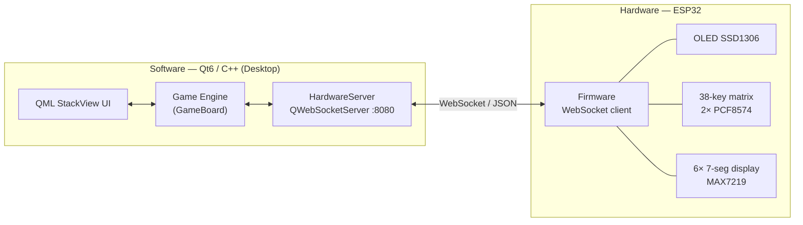

# DigitCode — Cyber-Physical Escape-Room Game

> A puzzle game that lives on **both** a desktop screen and a real electronic panel:
> a Qt6/C++ application and an ESP32 device stay synchronized in real time over a
> self-designed WebSocket/JSON protocol. Draw a 6-digit secret on physical 7-segment
> LEDs, buy clues, and crack the code before the timer runs out.


---

## What it is

**DigitCode** is a "Decorum"-inspired escape-room puzzle built as a **Cyber-Physical System**.
The virtual game board on screen and a physical control panel are two views of the *same* game
state — every button press on the hardware is processed by the software's rules, and every state
change (LED segments, OLED messages, score, timer) is pushed back down to the hardware. The goal
was to turn a purely-software "digital board" into a device you can actually touch.

## How a round plays

You start with **100 points** and a running clock. Points are the resource: the game is about
buying just enough information to deduce the secret before you run out.

1. **Ask a question.** Four clue types, each a different kind of deduction — `Q1` parity
   (odd/even), `Q2` comparison, `Q3` counting, `Q4` full check. Pressing one moves the engine
   into a `WAIT_*` state; you then choose which digit the question applies to.
2. **Pay for it.** A valid clue costs **5 points**, and the clock itself costs **1 point per
   minute**. Hesitation is priced too: press a question and fail to pick a target within
   10 seconds, and it costs you a point.
3. **Draw your answer.** Enter each digit by painting its individual segments on the 7-segment
   board — the backend reverse-decodes the segment pattern back into a digit.
4. **Verify.** A first wrong guess triggers a 4-second flashing warning; a second ends the game.
   Guess right and the clock stops.

## System architecture



## Highlights

- **Real-time client–server sync** over a custom JSON protocol on port 8080, with **full
  state re-sync on reconnect** so a device that drops WiFi mid-game recovers the exact board.
- **Game engine in C++/Qt** — a finite-state machine driving four clue types, a
  **constraint-based (Sudoku-like) puzzle generator**, a scoring/timer system, and a 2-strike
  verification rule, all wired through Qt signals & slots and exposed to QML via `Q_PROPERTY`.
- **"Draw-to-guess" mechanic** — the player draws each digit segment-by-segment on the LED board;
  the backend reverse-decodes the segment pattern back into a digit (`decodeDigitFromSegments`).
- **Robust ESP32 firmware** — non-blocking `millis()` scheduling, press-edge debounce,
  hold-to-confirm for destructive actions, and brownout self-recovery for the LED driver.

## Tech stack

| Layer | Tech |
|---|---|
| Application | Qt 6, C++ (game engine, networking), QML (multi-screen `StackView` UI) |
| Firmware | ESP32 (Arduino core), `arduino-cli` |
| Link | WebSocket + JSON (`QWebSocketServer` ↔ `WebSocketsClient`, ArduinoJson) |
| Hardware ICs | MAX7219 (7-seg driver), 2× PCF8574 (I/O expander), SSD1306 OLED |
| Build / tooling | CMake, Git, pyserial (serial logging) |

## Hardware

**Bill of materials (core):** ESP32 DevKit · OLED 0.96" I²C (SSD1306) · 2× PCF8574 · MAX7219 (bare
DIP-24) · 6× 7-segment displays (5161AS, common-cathode) · 10 kΩ ISET resistor.

**Signal buses**
- **I²C bus #1** (SDA 21 / SCL 22): OLED `0x3C` + row PCF8574 `0x20`
- **I²C bus #2** (SDA 4 / SCL 16): column PCF8574 `0x20` — second hardware bus used to avoid an
  address clash (see *Engineering notes*)
- **3-wire** MAX7219: DIN 23 / CLK 18 / CS 5

The 38-button matrix (6×7) runs entirely over I²C, leaving GPIOs free and avoiding the ESP32's
sensitive strapping/flash pins.

## Communication protocol (WebSocket / JSON, port 8080)

**Software → ESP32**

| `type` | Payload | When |
|---|---|---|
| `SYSTEM` | `cmd:"welcome"` | On connect |
| `DRAW` | `ledIdx` 0–5, `segIdx` 0–6, `val` | A LED segment changes |
| `OLED` | `layout:"text"` + `line1`/`line2`, or `layout:"default"` | Any game message |
| `STATS` | `time`, `points` | Every second |

**ESP32 → Software**

| `type` | Payload | Meaning |
|---|---|---|
| `PAD_SELECT` | `label` T…Y | Choose the target LED to draw on |
| `PAD_DRAW` | `segIdx` 0–6 | Paint one segment |
| `ACTION` | `btnId` (Q1–Q4, A–S, VERIFY, NEWGAME) | Logic / function button press |

## Engineering notes (things that actually broke, and the fixes)

- **I²C address clash → dual-bus solution.** Two cheap clone PCF8574 modules both answered at
  `0x20` regardless of the address jumpers. Instead of fighting the hardware, I moved the column
  expander onto the ESP32's **second hardware I²C bus** (`Wire1`) so both keep their default
  address on physically separate lines.
- **MAX7219 dark despite correct firmware.** A secondary datasheet summary said the ISET resistor
  goes to GND; following it left every segment dark. Cross-checking the **original Maxim datasheet**
  ("*ISET — connect to V+ through a resistor*") restored the reference current. Lesson: only the
  manufacturer datasheet is authoritative.
- **Design vs. reality: MCP23017 → PCF8574.** The on-hand expander wasn't the 16-pin part the
  design assumed but an 8-pin PCF8574, so the matrix was rebuilt around two 8-bit expanders.

Firmware was brought up **incrementally**: each block (`i2c_scanner`, `max7219_test`,
`matrix_test`) has its own test sketch under `firmware/tools/`, verified before integration.

## Repository layout

```
backend/     C++ game engine (gameboard) + WebSocket server (hardwareserver)
UI/          QML screens (Menu → Ready → Game → Result) + virtual LED board
firmware/    ESP32 firmware + per-block bring-up test sketches
docs/        Hardware schematic & design notes
main.cpp     App entry point   ·   CMakeLists.txt   ·   PROJECT_REPORT.md (full technical report)
```

## Build & run

**Desktop app** — Qt 6 + CMake:
```bash
cmake -B build && cmake --build build
./build/appdigitcode_single    # starts the WebSocket server on :8080
```

**Firmware** — `arduino-cli` (ESP32 core). Copy `firmware/DigitCodeFirmware/secrets.h.example`
to `secrets.h`, fill in WiFi + the PC's LAN IP, then:
```bash
arduino-cli compile --fqbn esp32:esp32:esp32 firmware/DigitCodeFirmware
arduino-cli upload  --fqbn esp32:esp32:esp32 -p /dev/cu.usbserial-0001 firmware/DigitCodeFirmware
```

## Status

- **Software** — complete: a full game is playable end-to-end, and the project builds cleanly (CMake, no errors).
- **Hardware display / mirroring** — verified on the real ESP32: the app drives the physical OLED
  and MAX7219 7-segment displays in real time over the WebSocket link (the output path works).
- **Remaining** — wiring the full 38-key button matrix so a game can also be *controlled* entirely
  from the hardware panel.

See [`PROJECT_REPORT.md`](PROJECT_REPORT.md) for the full technical write-up.

## Author

**Tạ Đức Hiếu** — Mechatronics Engineering, Advanced Program, HUST
[GitHub](https://github.com/tdhcoding) · taduchieu123@gmail.com
